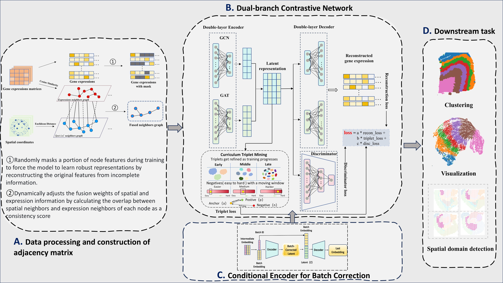

# AFPN-Net
Enhancing Spatial Domain Recognition in Spatial Transcriptomics Using Adaptive Graph Fusion and Progressive Negative Mining.
# Overview
With the rapid growth of spatial transcriptomics (ST) data, accurate identification of spatial structural domains is essential for deciphering tissue organization. However, integrating multi-batch datasets remains challenging due to inherent technical variations. To address this challenge, we present AFPN-Net, a representation-learning framework designed to enhance spatial domain identification. AFPN-Net adaptively fuses spatial proximity with expression similarity to learn discriminative embeddings for stable and precise domain delineation. It further incorporates conditional autoencoders to optimize spatial embeddings, mitigate batch effects, and ensure consistent performance across multi-batch integrations. Finally, AFPN-Net uses triplet loss with progressive hard-negative mining to jointly optimize boundary separability and local spatial coherence.

# Datasets
DPLFC: The primary source: https://github.com/LieberInstitute/spatialLIBD
（A sample dataset is provided in this repository to help users run and test the code. The remaining datasets used in the experiments will be uploaded progressively in future updates.）
# Usage

To run AFPN-Net on the DLPFC dataset, please execute:

```bash
python run_dlpfc.py
```

Before running the code, please make sure that the dataset path in `run_dlpfc.py` is correctly set.


